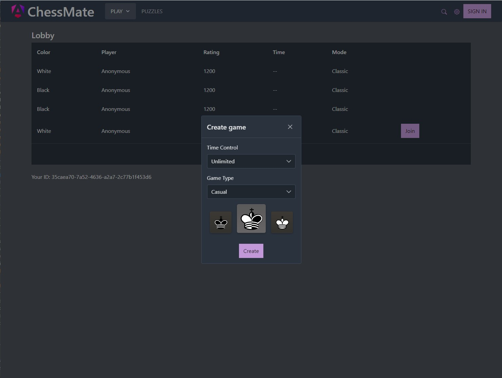
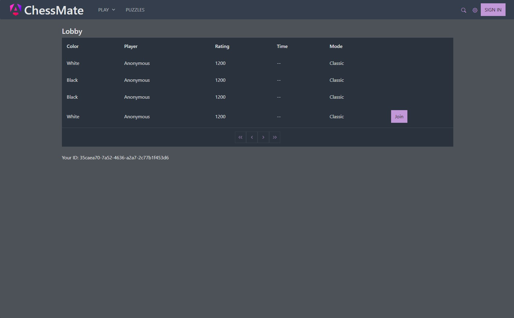
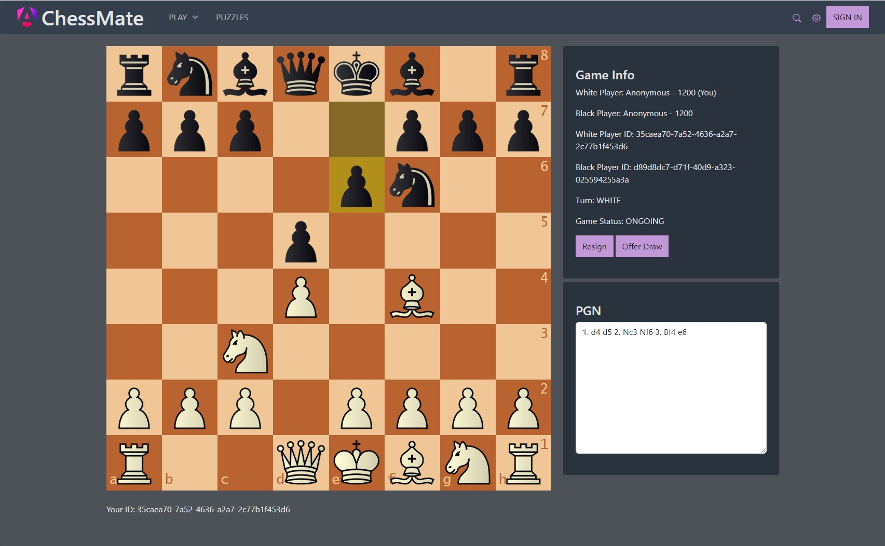

# ChessBet: Online Chess Platform
ChessBet is an online chess platform where players can engage in player-versus-player (PvP) matches or compete against AI. The platform supports both rated games and friendly matches, catering to a wide audience ranging from complete beginners to seasoned chess veterans. ChessBet's goal is to make chess more accessible and enjoyable for everyone by eliminating the need for physical boards or in-person opponents. This web-based application is developed with Spring Boot for the backend and React for the frontend.

## Architectural Overview
### Technical Stack
- **Spring Boot** - Backend framework for building REST API applications
- **Spring Data MongoDB** - Provides repository support for MongoDB data access
- **Spring Websocket** - Synchronizes game state between players in real-time
- **MongoDB** - Document database to store game data
- **JUnit** - Facilitates unit testing in Java
- **React + Vite** - Frontend SPA (`client/`)
- **chess.js / react-chessboard** - Browser chess board and move validation

### Design Patterns
- Mode-View-Controller (MVC)
- Repository
- Inversion of Control / Dependency injection

### Implemented Features
- Chess board with drag-and-drop functionality
- Real-time game synchronization using Websockets
- Chess engine integration for validating moves (converted the [Chess.js](https://github.com/jhlywa/chess.js) library to Java)
- Anonymous and authenticated user support

### Future Enhancements
- Resign and draw game options
- Authenticated game rooms for private matches
- User registration and profile management
- Leaderboard and game history tracking
- Stockfish engine integration for AI opponents
- Chat functionality between players
- UI improvements and responsive design

## Environment variables

Values are in the real files (gitignored — never commit):
- `backend/.env`
- `client/.env`

### Backend (`backend/.env`)

| Variable | Required | Description |
|---|---|---|
| `MONGODB_URI` | Yes | MongoDB Atlas connection string |
| `SERVER_PORT` | No | HTTP port (default `8000`; hosts may set `PORT`) |
| `APP_CORS_ORIGINS` | Yes for live | Frontend URL(s), comma-separated, no trailing slash |
| `APP_WS_ALLOWED_ORIGIN_PATTERNS` | Yes for live | Same frontend URL(s), or `*` for local |

### Frontend (`client/.env`)

| Variable | Required | Description |
|---|---|---|
| `VITE_API_URL` | Yes | REST base including `/api` |
| `VITE_WS_URL` | Yes | STOMP WebSocket (`ws://` local, `wss://` live) |

Vite bakes `VITE_*` at build time — change URLs, then rebuild.

## Getting Started (local)
1. Install JDK 21+, Node.js, and use MongoDB Atlas (or local Mongo).

2. Backend: `backend/.env` already has local defaults. Keep/update `MONGODB_URI`.

3. Client:
    ```shell
    cd ./client
    npm install
    ```
    `client/.env` already points at local API.

4. Run:
    ```shell
    cd ./backend
    ./gradlew bootRun
    ```
    ```shell
    cd ./client
    npm run dev
    ```

5. URLs:
    - Backend API: http://localhost:8000
    - Frontend UI: http://localhost:8001

> Legacy Angular app remains under `frontend/` but the supported UI is `client/`.

## Deploying (live)

### 1. Backend host
Set these on Railway / Render / Fly / VPS (do not commit secrets):
- `MONGODB_URI`
- `APP_CORS_ORIGINS` = live frontend URL (e.g. `https://your-app.vercel.app`)
- `APP_WS_ALLOWED_ORIGIN_PATTERNS` = same URL
- Port: host `PORT` is used automatically, or set `SERVER_PORT`

Build: `cd backend && ./gradlew bootJar` then run the JAR.

### 2. Frontend
In `client/.env`, set live URLs (`https://…/api` and `wss://…/ws`), then:
```shell
cd ./client
npm run build
```
Deploy `client/dist/`.

### 3. Checklist
- [ ] `.env` files are **not** in git
- [ ] Atlas network access allows your backend host
- [ ] CORS matches exact frontend URL (no trailing slash)
- [ ] Live client uses `https` + `wss`

## Screenshots



